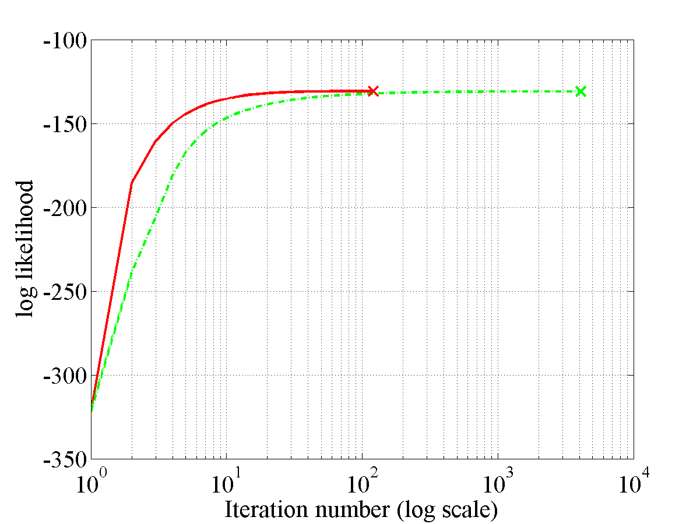

PPA Software
============

This page will describe examples of how to use the Probabilistic Point
Assimilation Software (PPA) available for [download
here](http://ext.dcs.shef.ac.uk/~u0015/cgi-bin/downloadForm.cgi?toolbox=ppa).

### Release Information

Current release is 0.1.

Release 0.1 is the first release of this software.

| **Toolbox**                          | **Version**                         |
+--------------------------------------+-------------------------------------+
| [KERN](/kern/downloadFiles)          | 0.142                               |
| [NDLUTIL](/ndlutil/downloadFiles)    | 0.15                                |
| [OPTIMI](/optimi/downloadFiles)      | 0.13                                |
| [PRIOR](/prior/downloadFiles)        | 0.13                                |
| [MLTOOLS](/mltools/downloadFiles)    | 0.11                                |
| [NOISE](/noise/downloadFiles)        | 0.13                                |

Finally you will also need the [NETLAB
toolbox](http://www.aston.ac.uk/eas/research/groups/ncrg/resources/netlab/) in your path.

Setting the test up
-------------------

In order for the code to function correctly, the files need to be set-up
in the structure depicted in the following figure


It should be noted that the [Gunnar
Datasets](http://users.rsise.anu.edu.au/~raetsch/data/index.html) have
had their original directory structure changed. For instance, for the
**Ringnorm** dataset the downloaded structure takes the form

`\\home\brain\raetsch\expose\ringnorm\*.asc`

but we have it as

`\\ROOT\mlprojects\data\ringnorm\*.asc .`

in our directory structure. Similarly any of the datasets needs to be in
the above form, with the data files being found within the directory
with the same name. We also note that all the required M file packages
need to be added to the path. All the test scripts are stored at
`ROOT/mlprojects/ppa/gunnarTests/` and the test M files are put into the
PPA `matlab ` directory.

### Enabling all scripts and M files for the tests

In the following scripts *ppaGunnarConvergence.sh*, *ppaGunnarPlot.sh*,
*ppaGunnar.sh*, *ppaGunnarResults.sh* and *ppaTestGunnar.sh* the line

`path('/home/nk3/mlprojects/matlab/general',path)`

needs to be changed to

`path('/USERSROOT/mlprojects/matlab/general',path)`

where `USERSROOT` is the location of the mlprojects directory.

It is also noted that the following files need changing to suit the
users file store as well, these M files are *ppaGunnarConvergence.m*,
*ppaGunnarData.m*, *ppaGunnarResults.m*, *ppaGunnarResultsTest.m*,
*ppaGunnarTest.m*, *ppaPlotConvergenceResults.m*,
*ppaPlotMultipleConvergenceResults1.m*,
*ppaPlotMultipleConvergenceResults2.m* and
*ppaPlotMultipleConvergenceResults3.m*.

We need to modify these test M files such that we are calling the
correct directory structure. As such you need to add or change the home
parameter to your `ROOT` directory. For instance in the files in there
orignal form the files have three home options which are

```
% My desktop
% HOME = 'h:\';
% My Laptop home
% HOME = 'd:\work';
% My Pascal cluster home
% HOME = '/home/nk3';
```

These cover the three machines I have run these tests on. You need to
change one of these such that

``` % Your Home
HOME = 'ROOT';
```

where `ROOT` is the directory in which the `mlprojects` directory is
stored. With these changes this completes the setup.

Four demos
----------

We have four simple demos that can be run from the directly from the ppa
directory (but still ensure the data stes are in the correct positon
within the directory structure). The first three tests are
classification tests on a linear seperable case, an overlap case and a
Banana dataset. The final case is a very simple regression case noise
model, although we do note that regression for the model is tractable
and does not require the approximation we include this test to show show
how easy it is to plug in different nosie models.

### Linear seperable demo

From the matlab command line, ensure you our within
`/USERSROOT/mlprojects/ppa/matlab.`

Now run the following command at the command prompt

```matlab
>>  demppa1
```

Once the model has reached convergence the following plot should be
displayed.

\
 This plot shows the final plot for the **linear seperable** dataset.

### Overlap demo

From the matlab command line, ensure you our within
`/USERSROOT/mlprojects/ppa/matlab.`

Now run the following command at the command prompt

`>>  demppa2`

Once the model has reached convergence the following plot should be
displayed.

\
 This plot shows the final plot for the **overlap** dataset.

### Banana demo

From the matlab command line, ensure you our within
`/USERSROOT/mlprojects/ppa/matlab.`

Now run the following command at the command prompt

```matlab
>>  demppa3
```

Once the model has reached convergence the following plot should be
displayed.


 This plot shows the final plot for the **banana** dataset.

### Regression demo

From the matlab command line, ensure you our within
`/USERSROOT/mlprojects/ppa/matlab.`

Now run the following command at the command prompt

```matlab
>>  demppaRegression1
```

Once the model has reached convergence the following plot should be
displayed.

 
 This plot shows the final plot for the **regression** dataset.

Convergence tests using the scripts
-----------------------------------

The script files were designed to be run on a SCG managed cluster
primarily the Pascal cluster. To run repeat the following

From the server command line run the following

```sh
$ bash ppaGunnarConvergenceSCG.sh
```

once all the processes have finished running you can then run

```sh
$ bash ppaGunnarplot.sh
```

this will result in the convergence figures being plotted. The EPS plots
will be saved in the following location

`ROOT\mlprojects\data\DATASETNAME\ICMLconv\ DATASETNAME_1 convFig.eps`

`ROOT\mlprojects\data\DATASETNAME\ICMLconv\ DATASETNAME_1_cpuFig.eps`

where the former is a plot of the convergence of the standard
variational method compared with that of the KL corrected bound and the
latter is a plot of the CPU times per iteration.

Convergence tests directly from the Matlab command line
-------------------------------------------------------

The following example is for the **banana** dataset and for the first
fold.

From the matlab command line move to the `ppa/gunnarTests` directory.

First run the following comman in the gunnarTest folder

```matlab
>>  ppaGunnarConvergence('banana',1)
```

after which there will be a bit of a wait.

After this process has finished now run the following command at the
command prompt

```matlab
>>  ppaPlotConvergenceResults('banana',1)
```

This command should result in the following information and plots to be
displayed.

```
KL classification = 0.1181633 and SV classification = 0.1179592
KL loglike = -130.8580181 and SV loglike = -130.8979431
KL total number of iterations = 120.0000000,
SV total number of iterations = 4102.0000000
The difference between the iteration numbers (SV - KL) = 3982.0000000
KL total CPU time = 1127.5400000 and SV total CPU time = 22544.1100000
The difference between the CPU times (SV - KL) = 21416.5700000`
```

 
 This plot shows the convergence figure for the **banana** dataset.

 
 This plot shows the CPU times figure for the **banana** dataset.

Note if you wished to run these for any of the other datasets just
substitute in the particular data sets name.

Classification tests
--------------------

Once again the scripts were designed to be run on the SCG managed pascal
cluster. To run them you need to set up the files as previously noted.

From the command prompt on the cluster you first need move to the
directory `ROOT\mlprojects\ppa\gunnartests\`. From there you frist run
the following

```
>>bash ppaGunnar.sh
```

this will send a lot of jobs to the cluster. These will take a while to
run so be prepared for a wait.

Once these jobs have completed the next step is to run the following
script

```
>>bash ppaGunnarResults.sh
```

Once again this will send a job to the cluster but unlike the other this
should only take a minute to run. Once this job is complete we then have
to finally run

```
>>bash ppaTestGunnar.sh
```

Once these final jobs has finished you will find in your `ROOT`
directory a set of .mat files namely

`banana.mat, breast-cancer.mat,diabetis.mat, german.mat, heart.mat, titanic.mat, twonorm.mat and waveform.mat.`

The mean and standard deviation of the test error for each data set can
be found by first loading the dataset's `*.mat` (in the following we are
loading the banana data set)

```
>> bananaLoad =  load('banana.mat')
```
we can then find the mean

```
>> meanB =  mean(bananaLoad.er)
```
and the standard deviation
```
>> meanB =  std(bananaLoad.er)
```

